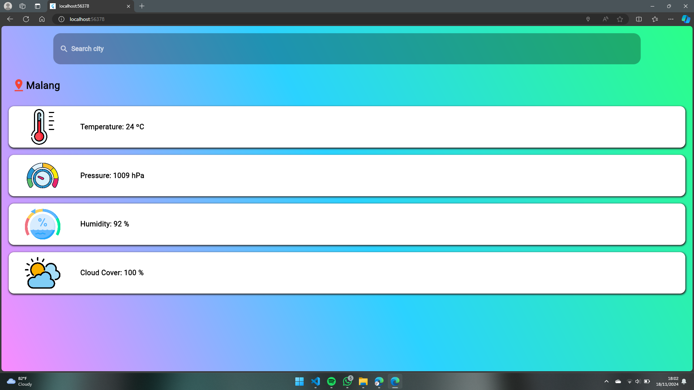

# LAPORAN JOBSHEET 12 - PEMROGRAMAN MOBILE

Nama    : Agung Nugroho

NIM     : 2241760135

Kelas   : SIB-3E

---

# Weather App Flutter

Aplikasi cuaca sederhana yang dibuat dengan Flutter. Aplikasi ini menggunakan OpenWeather API untuk menampilkan informasi cuaca berdasarkan lokasi pengguna atau pencarian kota.


## Penjelasan Kode Main.dart

### Import Statement
```dart
import 'package:flutter/material.dart';
import 'homescreen.dart';
```

Penjelasan:
- material.dart berisi widget-widget dasar Flutter dengan desain Material
- homescreen.dart berisi class HomeScreen untuk menampilkan UI utama aplikasi


### Fungsi Main

``` dart 
void main() {
  runApp(
    // Widget tree dimulai dari sini
  );
}
```

Penjelasan:
- Entry point aplikasi Flutter
- runApp() menginisialisasi dan menjalankan aplikasi Flutter


### MaterialApp Widget
```dart
MaterialApp(
  debugShowCheckedModeBanner: false,
  home: const HomeScreen(),
  theme: ThemeData(
    primaryColor: Colors.white,
    colorScheme: ColorScheme.fromSwatch().copyWith(secondary: Colors.white),
  ),
)
```

Penjelasan:
- MaterialApp: Widget root yang menyediakan berbagai fungsi material design
- debugShowCheckedModeBanner: false: Menghilangkan banner "Debug" di pojok kanan atas
- home: const HomeScreen(): Menentukan halaman pertama yang ditampilkan
- theme: ThemeData(...): Mengatur tema aplikasi

### Theme Configuration
```dart
theme: ThemeData(
  primaryColor: Colors.white,
  colorScheme: ColorScheme.fromSwatch().copyWith(secondary: Colors.white),
)
```

Penjelasan:
- primaryColor: Mengatur warna utama aplikasi menjadi putih
- colorScheme: Mengatur skema warna aplikasi
- secondary: Colors.white: Mengatur warna aksen (secondary) menjadi putih

## Penjelasan Kode Homescreen.dart

### Import Statement
```dart
import 'package:flutter/material.dart';
import 'package:geolocator/geolocator.dart';
import 'package:http/http.dart' as http;
import 'dart:convert'; 
```

Penjelasan:
- material.dart: Widget dasar Flutter
- geolocator: Package untuk mengakses lokasi perangkat
- http: Package untuk melakukan HTTP request
- dart:convert: Library untuk encoding/decoding JSON

### Konstanta
``` dart
const String domain = "https://api.openweathermap.org/data/2.5/weather?";
const String apiKey = "YOUR_API_KEY";
```

Penjelasan:
- URL endpoint API OpenWeather
- API key untuk autentikasi

### State Management
``` dart
class _HomeScreenState extends State<HomeScreen> {
  bool isLoaded = false;
  num? temp, press, hum, cover;
  String cityname = '';
  TextEditingController controller = TextEditingController();
}
```

Penjelasan:
- isLoaded: Status loading data
- temp: Temperatur
- press: Tekanan udara
- hum: Kelembaban
- cover: Tutupan awan
- cityname: Nama kota
- controller: Controller untuk input pencarian

## Fungsi Utama

### Get Location Data
```dart
void getCurrentLocation() async {
  var position = await Geolocator.getCurrentPosition(
    desiredAccuracy: LocationAccuracy.low,
  );
  getCurrentCityWeather(position);
}
```

Penjelasan: Mengambil posisi perangkat saat ini

### Get Weather Data
```dart
Future<void> getCurrentCityWeather(Position position) async {
  // Implementation
}

Future<void> getCityWeather(String cityName) async {
  // Implementation
}
```

Penjelasan: 
Mengambil data cuaca berdasarkan:
- Koordinat lokasi
- Nama kota

### Update UI
```dart
void updateUI(var decodedData) {
  setState(() {
    // Update state values
  });
}
```

Penjelasan: Memperbarui UI dengan data cuaca yang diterima

## UI Components
### Main Container
```dart
Container(
  decoration: const BoxDecoration(
    gradient: LinearGradient(
      colors: [
        Color(0xffFA8BFF),
        Color(0xff2BD2FF),
        Color(0xff2BFF88),
      ],
      begin: Alignment.bottomLeft,
      end: Alignment.topRight,
    ),
  ),
)
```

### Search Input
```dart
TextFormField(
  onFieldSubmitted: (String s) {
    // Handle search
  },
  // Style and decoration
)
```

### Weather Cards
```dart
Widget buildWeatherCard(String label, String value, String imagePath) {
  // Card implementation
}
```

# HASIL

## Edge


