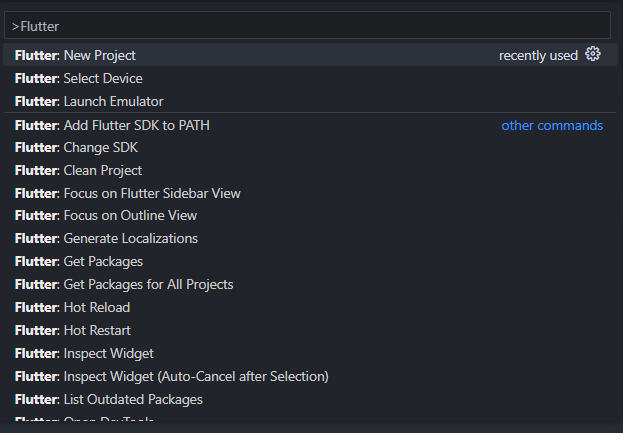
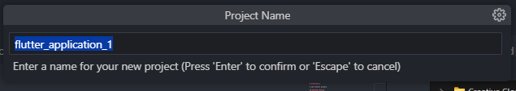
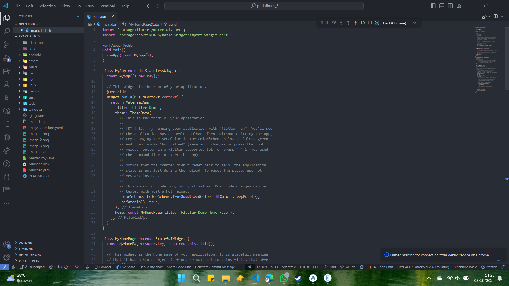
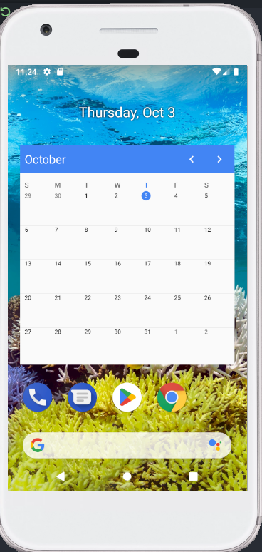

# praktikum_5

A new Flutter project.

## Getting Started

This project is a starting point for a Flutter application.

A few resources to get you started if this is your first Flutter project:

- [Lab: Write your first Flutter app](https://docs.flutter.dev/get-started/codelab)
- [Cookbook: Useful Flutter samples](https://docs.flutter.dev/cookbook)

For help getting started with Flutter development, view the
[online documentation](https://docs.flutter.dev/), which offers tutorials,
samples, guidance on mobile development, and a full API reference.

# PRAKTIKUM 1: Membuat Project Flutter Baru

# Langkah 1:
Buka VS Code, lalu tekan tombol CTRL + SHIFT + P maka akan tampil Command Palette, lalu ketik Flutter. Pilih New Application Project

[Catatan: Anda dapat mengakses Command Palette dengan cara lain, yaitu pilih menu View > Command Palette. Tombol shortcut Ctrl + Shift + P mungkin hanya berlaku di Windows.]

# Langkah 2:
Kemudian buat folder sesuai style laporan praktikum yang Anda pilih. Disarankan pada folder dokumen atau desktop atau alamat folder lain yang tidak terlalu dalam atau panjang. Lalu pilih Select a folder to create the project in.

# Langkah 3:
Buat nama project flutter hello_world seperti berikut, lalu tekan Enter. Tunggu hingga proses pembuatan project baru selesai.

[Perhatian: Nama project ini harus lowercase (huruf kecil semua) tanpa menggunakan spasi. Untuk memisahkan kata, bisa menggunakan underline (garis bawah). Nama project tidak dapat diawali dengan angka atau karakter khusus lain. Nama project ini bukan nama aplikasi yang akan tampil di Play Store atau App Store. Untuk nama aplikasi, nanti dapat diatur ketika melakukan deployment.]

# Langkah 4:
ika sudah selesai proses pembuatan project baru, pastikan tampilan seperti berikut. Pesan akan tampil berupa "Your Flutter Project is ready!" artinya Anda telah berhasil membuat project Flutter baru.

# PRAKTIKUM 2: Menghubungkan Perangkat Android atau Emulator
Melanjutkan dari praktikum 1, Anda diminta untuk menjalankan aplikasi ke perangkat fisik (device Android atau iOS). Silakan ikuti langkah-langkah pada codelab tautan berikut ini.

# PRAKTIKUM 3: Membuat Repository GitHub dan Laporan Praktikum

# Langkah 1:
Login ke akun GitHub Anda, lalu buat repository baru dengan nama "flutter-fundamental-part1"

# Langkah 2:
Lalu klik tombol "Create repository" lalu akan tampil seperti gambar berikut

# Langkah 3:
Kembali ke VS Code, project flutter hello_world, buka terminal pada menu Terminal > New Terminal. Lalu ketik perintah berikut untuk inisialisasi git pada project Anda.

# Langkah 4:
Pilih menu Source Code di bagian kiri, lalu lakukan stages(+) pada file .gitignore untuk mengunggah file pertama ke repository GitHub.

# Langkah 5:
Beri pesan commit "tambah gitignore" lalu klik Commit (✔)

# Langkah 6:
Lakukan push dengan klik bagian menu titik tiga > Push

# Langkah 7:
Di pojok kanan bawah akan tampil seperti gambar berikut. Klik "Add Remote"

# Langkah 8:
Salin tautan repository Anda dari browser ke bagian ini, lalu klik Add remote

Setelah berhasil, tulis remote name dengan "origin"

# Langkah 9:
Lakukan hal yang sama pada file README.md mulai dari Langkah 4. Setelah berhasil melakukan push, masukkan username GitHub Anda dan password berupa token yang telah dibuat (pengganti password konvensional ketika Anda login di browser GitHub). Reload halaman repository GitHub Anda, maka akan tampil hasil push kedua file tersebut seperti gambar berikut.

[Perhatian: Personal access token GitHub dapat Anda buat melalui https://github.com/settings/tokens/new atau dapat membaca dokumentasi GitHub Token.]

# Langkah 10:
Lakukan push juga untuk semua file lainnya dengan pilih Stage All Changes. Beri pesan commit "project hello_world". Maka akan tampil di repository GitHub Anda seperti berikut.

# Langkah 11:
Kembali ke VS Code, ubah platform di pojok kanan bawah ke emulator atau device atau bisa juga menggunakan browser Chrome. Lalu coba running project hello_world dengan tekan F5 atau Run > Start Debugging. Tunggu proses kompilasi hingga selesai, maka aplikasi flutter pertama Anda akan tampil seperti berikut.

[Perhatian: Proses Run atau kompilasi untuk pertama kali akan memakan waktu cukup lama (3-5 menit). Namun, proses kompilasi berikutnya menjadi lebih cepat. Berbeda ketika melakukan kompilasi ke device, hal ini akan memakan waktu lebih lama lagi.]

# Langkah 12:
Silakan screenshot seperti pada Langkah 11, namun teks yang ditampilkan dalam aplikasi berupa nama lengkap Anda. Simpan file screenshot dengan nama 01.png pada folder images (buat folder baru jika belum ada) di project hello_world Anda. Lalu ubah isi README.md seperti berikut, sehingga tampil hasil screenshot pada file README.md. Kemudian push ke repository Anda.

[Perhatian: Lakukan proses screenshot seperti pada Langkah 12 untuk setiap Laporan Praktikum yang Anda akan buat pada praktikum selanjutnya hingga pertemuan project final.]

# PRAKTIKUM